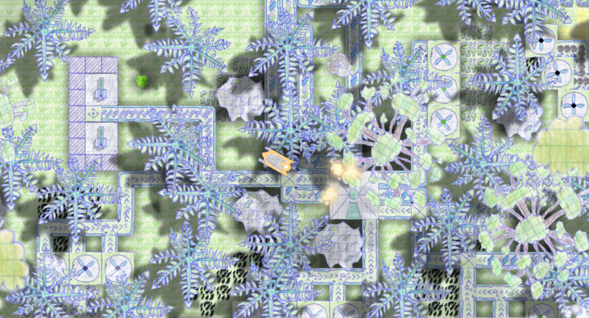
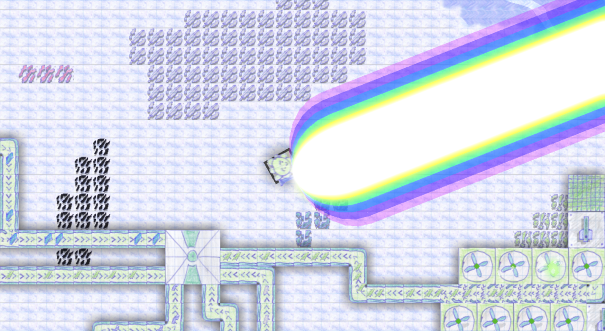

## 🐙 OCTOPUS DEFENCE
> **Версия / Version:** `Alpha 0.7.9.3`

# ПУНЯ ПУНЯ ПУНЯ

<!-- Логотип мода по центру под названием -->

  

---

## 📸 Скриншоты / Screenshots

  
  

## 🇷🇺 RUS: Описание мода

Всем пруветь! Это моё довольно большой и необычный мод в который контент заталкивался ногами, пока папка мода не раздулась до 42 мегаБАЙТ (*бадам-тусс* скоро будет 50)

Тут есть просто всякое, ещё больше всякого, и отдельные штуковины, которые взрываются прямо тебе в лицо (смотрим на тебя, вертолёт ПГВ-1, устраивающий локальный апокалипсис с морем кастомной жижи). Половина штук ещё в процессе допила, так что стабильности не ждите.

**🐙 Кто такие Пуни?**
Если вы думали, что Пуни — это какие-то непонятные монстры, то нет. Пуни — это супер милые маленькие осьминожки! =) Они настолько очаровательные, что вы захотите их обнять. Правда их планету захватывают роботы и вы должны им помочь так что... удачи!

**⚠️ ВАЖНОЕ ОБЪЯВЛЕНИЕ:** 
Мод находится в состоянии «оно как бы работает, но лучше не дышать». Если вы нашли баг, то **НЕ НАДО** писать мне в личные сообщения. Для этого есть вкладка **Issues** прямо здесь, на GitHub! Создавайте тикет там, описывайте проблему и прикладывайте краш-логи. Но имейте в виду: если вы прибежите с криками «срочно почини!» — вы будете успешно проигнорированы. Баги будут исправляться на моей волне и исключительно в моё личное время. 

Я без понятия, это чистой воды произведение искусства, созданное в процессе долгого и упорного кодинга.

## 🌟 Особые благодарности

Этот мод вряд ли бы появился без идей, концептов и творчества людей, у которых я с уважением подсмотрел всё самое лучшее:

*   **[Anuken](https://github.com/Anuken)** — за создание *Mindustry*, основы для всех механик и пожирателя моего свободного времени.
*   **BYRIL LLC** — за их крутой блокнотный стиль графики.
*   **[LixieWulf](https://github.com)** — за идеи с окружением и игровыми механиками, которые заставили меня сказать: «Вау, мне это тоже надо».
*   **[Sh1penfire](https://github.com)** — за крутые мысли по реализации некоторых механик.
*   **[ItsKirby69](https://github.com)** — за вдохновение в оформлении игрового мира.
*   **[FlinTyX](https://github.com)** — за идею добавить животных, потому что с ними игра выглядит гораздо живее.
*   **[Catana791](https://github.com/Catana791)** — за контентную базу и крутые геймплейные наработки, подсмотренные в его модах.
*   **[EyeOfDarkness](https://github.com)** — за концепты ядерного оружия, лазеров и визуальных эффектов (VFX). Делать тихо — скучно, всё должно бабахать красиво!
*   **[MEEPofFaith](https://github.com/MEEPofFaith)** — за вдохновение его техническим хаосом и идею добавить тотальный ядерный апокалипсис.
*   **Мой брат** — за то, что превратил наброски для треков *Boss 1*, *Land*, *Launch* и главного меню в отличные саундтреки.

---

## 🇺🇸 ENG: Mod Description

**⚠️ WARNING:** my english is bad so you can make a pr to fix my dumb translation. im too lazy to fix this translation
Hello everyone! This is my rather large and unique mod, into which the content was pushed with my feet until the mod folder swelled to 42 megabytes (*badam-tuss* will soon be 50)

There's just everything, even more, and individual gizmos that explode right in your face (we're looking at you, the PGV-1 helicopter, staging a local apocalypse with a sea of custom sludge). I've finished half of them in the process, so don't expect stability.

**🐙 Who are the Punies?**
If you thought that Punies were some kind of incomprehensible monsters, then no. Puny are super cute little octopuses! =) They are so adorable that you will want to hug them. However, their planet is being invaded by robots and you have to help them, so... good luck!

**⚠️ IMPORTANT NOTICE:** 
The mod is currently in a "it works, but don't breathe on it" state. If you find a bug, **DO NOT** spam my DMs. Use the **Issues** tab right here on GitHub! Open a ticket, describe what happened, and attach your crash logs. But keep in mind: if you come screaming "fix it now!" — you will be successfully ignored. I will address bugs on my own time and whenever I feel like it.

idk, this is pure work of art created in the process of long and dedicated coding.

### 🎵 Custom Soundtrack:
Vanilla Mindustry tracks are completely gone. I replaced EVERY single track with my own music (14 tracks total). New vibes everywhere — from the main menu to sweaty boss waves. All files are strictly in `.ogg` format, but they still weigh like a brick. (lmao some tracks are ~~*stealed*~~ taked from CC0.)

## 🌟 Special Thanks

This mod wouldn't have been possible without the amazing ideas, concepts, and creativity of these awesome folks. Shoutout to everyone I proudly took inspiration from:

*   **[Anuken](https://github.com)** — for creating *Mindustry*, providing the foundation for all mechanics, and consuming all of my free time.
*   **BYRIL LLC** — for their legendary notebook/doodle art style. Their games inspired me to sit down and completely hand-draw this entire mod. My fingers are bruised, but the style was totally worth it!
*   **[LixieWulf](https://github.com)** — for environment concepts and mechanics that made me go, "Wow, I need that too."
*   **[Sh1penfire](https://github.com)** — for great insights on how to implement some of the gameplay mechanics.
*   **[ItsKirby69](https://github.com)** — for showing me what a great environment looks like.
*   **[FlinTyX](https://github.com)** — for the idea of adding animals, because a game world feels way more alive with them running around.
*   **[Catana791](https://github.com)** — for the massive content base and awesome gameplay ideas inspired by his mods.
*   **[EyeOfDarkness](https://github.com)** — for nukes, lasers, and flashy VFX concepts. Keeping things quiet is boring, everything needs to blow up beautifully!
*   **[MEEPofFaith](https://github.com)** — for inspiring me with his chaotic tech and the brilliant idea to add total nuclear annihilation.
*   **My Bro** — for turning rough drafts for *Boss 1*, *Land*, *Launch*, and *Menu* into absolute musical bangers.

---

## 🛠 Установка / Installation
1. Скопируй ссылку на этот репозиторий GitHub / Copy this GitHub repository link.
2. Mindustry -> **Моды (Mods)** -> **Импорт мода (Import Mod)** -> **GitHub**.
3. Вставляй ссылку и молись, чтобы игра не крашнулась / Paste the link and pray the game doesn't crash from all this content.